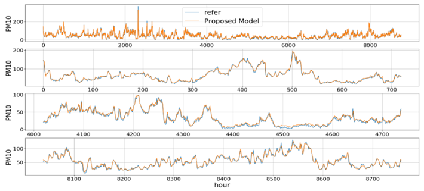
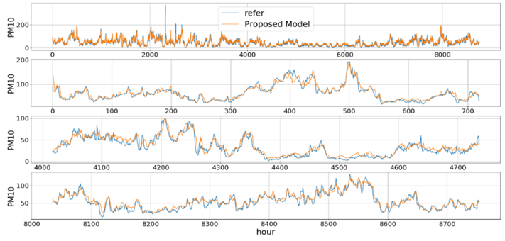
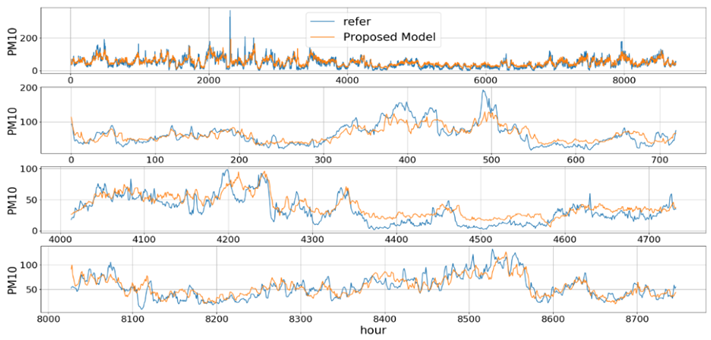
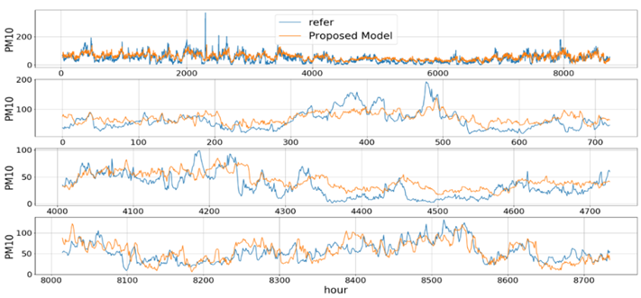

# Research-of-Particulate-Matter-Prediction-Modeling-Based-on-Deep-Learning

## 1.Summary
- The goal of this study is **to develop a deep learning-based PM prediction model using China PM data, domestic meteorological data and domestic pollution data** to consider the environment in South Korea.   
- To do this, we propose a **Deep Particulate Matter Network** with a Separated Input model based on deep learning by **using ConvGRU, which can simultaneously analyze spatiotemporal information to consider the diffusion of particulate matter**. 
- This study used three main novel method to increase prediction accuracy (see 6.model).  
- Experiments are designed **to predict the PM10 over the next N hour (N=1,4,12,24) with a spatial resolution of 8x10 grids over all regions in Korea**. The proposed Deep-learning model shows better prediction performance than the previous deep learning (LSTM, CNN+LSTM, ConvLSTM) based models . 
 
## 2.Skill
#### Language 
Python
#### OS 
Window, Linux
#### IDE  
Spyder 
#### Framework & Library
Pandas, Numpy, Keras, Tensorflow
 

## 3.Work flow
- All meteorological data and pollution data in Korea were **mapped to an 8x10 2-D spatial grid as shown below**. The data for each region were generated by averaging all measured data in the region.   
  

 
 
 
 
 - The temporal predictors, including the season and hours of the day were mapped with the same value to all regions 
 - The spatial predictors, including the x coordinate and y coordinate were individually mapped to each region based on the rows and columns of the grid.  
 - In the case of the China data, for which do not have 2-D spatial information, This study used a forward-fix to interpolate between data points. This method estimates the missing value with the most recently measured value.
 - **The collected data have some unmeasured values**, since measuring stations are neither co-located nor uniformly distributed. Domestic data have 2-D spatial information, so this study **used the Inverted Distance Weight (IDW) method** to interpolate between these data.
 

 
 

## 4.Hyper parameter
|Parameter|Value|
|:---:|:---:|
|Training data|60% (2014~2016)|
|Validation data|20% (2017)|
|Testing data|20% (2018)|
|Prediction length (T, hour)|[1, 4, 12, 24]|
|History length (hour)|24|
|Time interval (hour)|1|
|Optimizer|Amsgrad|
|Learning rate|0.00075|
|Max training epochs|100|
|Loss function|Mean square error|
|Callback method|Early stopping with patience = 10|

## 5.Used data
#### raw data
1. pollution data in Korea : https://www.airkorea.or.kr/web/last_amb_hour_data?pMENU_NO=123.
2. meteorological data in Korea : https://data.kma.go.kr/data/grnd/selectAsosRltmList.do?pgmNo=36.
3. particulate matter in China : http://www.stateair.net/web/post/1/1.html

#### model input data
if you want to know T,W,C input, please see 6.Model.
|#|Variable|Dimension (C input)|T input|W input|C input|
|:---:|:---:|:---:|:---:|:---:|:---:|
|0|PM10(μg/m3)|scalar(7)|O|O|O|
| 1  | SO2(ppm)                    | scalar         | O        | -        | O        |
| 2  | NO2(ppm)                    | scalar         | O        | -        | O        |
| 3  | Temperature(℃)                    | scalar         | O        | -        | O        |
| 4  | Wind speed(m/s)                     | scalar         | O        | O        | O        |
| 5  | Humidity(%)                 | scalar         | O        | O        | O        |
| 6  | Air pressure(hPs)                     | scalar         | O        | -        | O        |
| 7  | Wind_u factor(m/s)                  | scalar (7)     | -        | O        | O        |
| 8  | Wind_v factor(m/s)                 | scalar (7)     | -        | O        | O        |
| 9  | Precipitation(cm)                    | scalar         | O        | -        | O        |
| 10 | Daily largest temperature difference(℃)                     | scalar         | O        | -        | O        |
| 11 | Daily minimum temperatrue(℃)                  | scalar         | O        | -        | O        |
| 12 | Beijing PM2.5(μg/m3)             | 24             | -        | -        | O        |
| 13 | Season                      | 4              | O        | -        | O        |
| 14 | hour                    | 6              | O        | -        | O        |
| 15 | X axis in grid                    | scalar         | O        | -        | O        |
| 16 | Y axis in grid                    | scalar         | O        | -        | O        |

## 6.Model
#### input part
 With the previous 24 hours of data, This model predicts the next r hours PM concentration in each region divided by an 8x10 grid in South Korea.   
- The terrain part (T) extracts features based on individual region-dependent characteristic data using domestic meteorological data and pollution data.   
- The Wind part (W) extracts features based on domestic PM diffusion by wind using domestic wind component data and PM data.  
- The China part (C) extracts features based on external inflow using data related to China.  
 
 Each separated input part extracts the primary feature using only the input variables related to the influencing factors.  
 The parentheses in the input parts represent the input dimensions. The T and W parts use the 4-D tensor data, including time and space dimensions (time-step, x coordinate in grid, y coordinate in grid, input feature). The C part uses the 3-D tensor data, including only the spatial dimension (x coordinate in grid, y coordinate in grid, input feature). 
 The parentheses in all layers represent the output dimension, and the last dimension is the number of filters in each layer. The square brackets in some layers that use the convolution operation represent the kernel size for the 2-D spatial axis. 

#### Why was this model designed like this?
(1) It was designed with mutually exclusive features extracted at the lowest level through **partitioned three input to separately consider each influencing factor (i.e., region dependent factor, diffusion factor and external influent factor) in more detail**.  
(2) It used **the Convolutional Gate Recurrent Unit (ConvGRU) (which can analyze 3-D spatiotemporal information at the same time) to consider diffusion phenomena and reduce the high memory usage** and computational complexity of ConvLSTM.  
(3) It used a **locally connected layer, which can extract independent features on the specific receptive field more effectively than a convolutional layer for analyzing how external inflow of a PM affects individual regions** in more detail. 
 

## 7.Code
### Pre-processing
(TBD)
### Training model
(TBD)
## 8.Result
This is an prediction example of one area in Korea divided 8x10 grid.  
- top subplot represents a result of one year(2018). 
- 2nd subplot represents a result of first month(2018.1). 
- 3rd subplot represents a result of one month in middle of year. 
- bottom subplot represents a result of last month(2018.12). 

next 1hour 
 
next 4hour 
 
next 12hour 
 
next 24hour 
 

## 9.Recommanded paper to follow this research
1. Li, X., Peng, L., Yao, X., Cui, S., Hu, Y., You, C., & Chi, T. (2017). Long short-term memory neural network for air pollutant concentration predictions: Method development and evaluation. Environmental Pollution, 231, 997–1004.
2. Huang, C. J., & Kuo, P. H. (2018). A deep cnn-lstm model for particulate matter (Pm2.5) forecasting in smart cities. Sensors (Switzerland), 18(7).
3. Shi, X., Chen, Z., Wang, H., Yeung, D.-Y., Wong, W., & Woo, W. (2015). Convolutional LSTM Network: A Machine Learning Approach for Precipitation Nowcasting, In arXiv preprint arXiv:1506.04214
